# Resíduos Chapecó: análise de resíduos orgânicos com Machine Learning

Projeto interdisciplinar entre Ciência da Computação e Engenharia Química, Universidade Comunitária da Região de Chapecó (UNOCHAPECÓ)

Este projeto aplica aprendizado de máquina a dados de um questionário sobre geração e descarte de resíduos orgânicos na região de Chapecó, SC. O objetivo é identificar padrões de comportamento, perfis de geradores e oportunidades concretas de intervenção para reaproveitamento.

## Introdução

A gestão de resíduos orgânicos em municípios brasileiros de médio porte enfrenta desafios estruturais e comportamentais. A maior parte dos resíduos orgânicos gerados por residências e pequenos estabelecimentos segue para a coleta pública comum, sem qualquer forma de reaproveitamento. Essa dinâmica resulta em sobrecarga de aterros, perda de nutrientes que poderiam retornar ao solo e desperdício de oportunidades econômicas e ambientais. Apesar de iniciativas pontuais de compostagem e coleta seletiva, a adesão da população permanece limitada, e os fatores que explicam essa lacuna entre percepção e ação ainda são pouco explorados com métodos quantitativos.

O presente projeto investiga esse problema no contexto de Chapecó, SC, município de aproximadamente 230 mil habitantes localizado no oeste catarinense. A pesquisa é parte de uma colaboração interdisciplinar entre os cursos de Ciência da Computação e Engenharia Química da Universidade Comunitária da Região de Chapecó (UNOCHAPECÓ). Enquanto a Ciência da Computação contribui com técnicas de aprendizado de máquina para identificar padrões e perfis nos dados, a Engenharia Química atua no desenvolvimento e na validação de processos concretos de reaproveitamento de resíduos orgânicos. A convergência dessas duas frentes permite que os resultados analíticos se traduzam em ações práticas de intervenção.

## Pergunta de pesquisa

A pergunta central do projeto é: até que ponto as respostas do questionário permitem identificar perfis de geradores e prever comportamentos ligados ao reaproveitamento de resíduos orgânicos?

## Resumo

A partir de 161 respostas coletadas em uma fase preliminar de coleta ainda em andamento, foram identificados três perfis de geradores por agrupamento: Indecisos (55), Engajados (52) e Potencial latente (45). Dois modelos de classificação foram avaliados. O modelo de previsão de destino do resíduo não apresentou capacidade preditiva (AUC = 0.50), sugerindo que o destino depende mais de fatores externos, como infraestrutura de coleta e acesso a alternativas. O modelo de previsão de tentativa de reutilização obteve desempenho moderado (AUC = 0.76, acurácia de 74%), indicando que o comportamento de reutilização está mais associado a fatores internos, como percepção, interesse e disposição para agir. A variável mais importante para esse modelo foi `potencial_reaproveitamento`. Foram identificadas 18 pessoas com perfil favorável à reutilização que nunca tentaram reutilizar, das quais 100% acreditam no reaproveitamento. Esse subgrupo representa a principal oportunidade de intervenção identificada, gerando um volume estimado de 6.786 kg de resíduos orgânicos por ano que poderiam ser reaproveitados.

## Metodologia

### Limpeza dos dados

A base bruta foi organizada para que as etapas seguintes trabalhassem com respostas comparáveis e mais consistentes (ver `00_limpeza_dados.ipynb`).

#### Renomeação das colunas

As 19 colunas do Google Forms foram renomeadas para nomes curtos e estáveis, facilitando a leitura da base e a construção dos modelos.

| Coluna original | Nome novo |
| --- | --- |
| Carimbo de data/hora | `timestamp` |
| Você é: | `tipo_gerador` |
| Qual é o principal tipo de atividade exercida? | `tipo_atividade` |
| Qual bairro/cidade você se encontra? | `bairro_cidade` |
| Quais tipos de resíduos são gerados com maior frequência? | `tipos_residuo` |
| Sobre RESÍDUOS ORGÂNICOS, que tipo de resíduo é gerado em maior quantidade? | `residuos_organicos` |
| Especifique os principais resíduos gerados: | `especificacao_residuos` |
| Como esse resíduo orgânico é gerado? | `origem_residuo` |
| Com que frequência é feito o descarte dos resíduos gerados? | `frequencia_descarte` |
| Quantidade média gerada e descartada: | `quantidade_gerada` |
| Qual o destino atual do resíduo? | `destino_atual` |
| Existe algum custo associado à destinação? | `custo_destinacao` |
| Você considera que este resíduo ou parte dele poderia ser reaproveitado? | `potencial_reaproveitamento` |
| O resíduo apresenta alguma das seguintes características? | `caracteristica_residuo` |
| Já houve tentativa de reutilização? | `tentativa_reutilizacao` |
| Na sua opinião, qual seria a melhor solução para esse resíduo? | `melhor_solucao` |
| Quantas pessoas vivem ou trabalham neste local e são responsáveis pela quantidade de resíduos gerados? | `num_pessoas` |
| Você já recebeu alguma conscientização sobre reutilização de resíduos? | `conscientizacao` |
| Você teria interesse em aprender formas de reaproveitamento de resíduos? | `interesse_aprender` |

#### Padronização de bairros e localidades

O campo `bairro_cidade` foi padronizado para reduzir variações de digitação e respostas heterogêneas. Mais de 30 variações de escrita foram consolidadas em categorias padronizadas, e os casos fora dos padrões definidos foram mantidos em `Outro`.

- `Outro` concentrou 18 registros, aproximadamente 11% da base.
- Respostas de fora da região imediata de Chapecó, como Guarapuava, PR, Rio de Janeiro, RJ, e outras localidades externas, foram preservadas na base e classificadas como `Outro`.

#### Padronização de `destino_atual`

O campo `destino_atual` incluía respostas de texto livre além das opções fechadas. As respostas foram consolidadas em seis categorias principais mediante busca por palavras-chave, conforme detalhado a seguir (ver `00_limpeza_dados.ipynb`).

As regras aplicadas foram:

- `Compostagem`, para respostas contendo termos como `compost` ou `minhoca`
- `Reaproveitamento`, para respostas contendo termos como `galinha`, `porco`, `lavagem`, `alimentação`, `reaprov`, `enterro`, `doação`
- `Coleta seletiva`, para respostas contendo `seletiva`
- `Coleta pública comum`, para respostas contendo `pública` ou `publica`
- `Descarte`, para respostas contendo `descarte`, `aterro` ou `queima`
- `Não sei`, para respostas contendo `não sei`

Quando uma resposta misturava mais de uma categoria, prevaleceu a primeira categoria encontrada na ordem de limpeza. Depois da padronização, `destino_atual` passou a ter a seguinte distribuição:

- `Coleta pública comum`, 84
- `Coleta seletiva`, 32
- `Compostagem`, 24
- `Reaproveitamento`, 15
- `Descarte`, 5
- `Não sei`, 1

#### Colunas com dados insuficientes

Algumas variáveis apareceram com preenchimento insuficiente para análises mais confiáveis:

- `frequencia_descarte`, 9 respostas em 161
- `conscientizacao`, 0 respostas em 161

Essas colunas foram mantidas no CSV limpo por rastreabilidade, mas removidas das análises e dos modelos.

#### Respostas removidas da modelagem

Os modelos de clusterização e classificação trabalharam com 152 respostas.

- 9 respostas sem `num_pessoas` e `interesse_aprender` foram removidas da etapa de modelagem.
- Esse descarte deveu-se ao ajuste do formulário após as primeiras coletas.

### Análise exploratória

Antes da aplicação dos modelos, foram gerados gráficos de distribuição para cada variável, com o objetivo de compreender a composição da amostra. Variáveis categóricas foram contabilizadas diretamente, e questões de múltipla seleção foram tratadas separando e contando cada opção individualmente.

A Figura 1 apresenta a composição da amostra por tipo de gerador. A grande maioria dos respondentes se identificou como pessoa física em contexto residencial, o que reflete o perfil predominantemente doméstico da amostra.

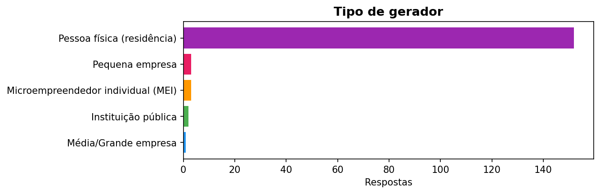

*Figura 1. Distribuição dos tipos de gerador entre os 161 respondentes. Pessoas físicas (residências) representam a maioria absoluta da amostra.*

A Figura 2 detalha os tipos de resíduos orgânicos gerados com maior frequência. Restos de comida apareceram como categoria dominante, seguidos por cascas de frutas, cascas de ovos e cascas de legumes.

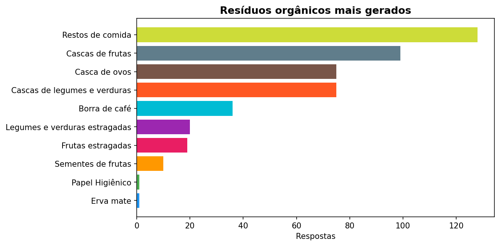

*Figura 2. Tipos de resíduos orgânicos mais frequentes, contabilizados individualmente a partir de respostas de múltipla seleção. Restos de comida lideraram com aproximadamente 128 menções.*

Quando perguntados se o resíduo poderia ser reaproveitado, a maioria dos respondentes respondeu afirmativamente, como indica a Figura 3. Essa percepção mostrou-se central nos modelos de classificação descritos adiante.

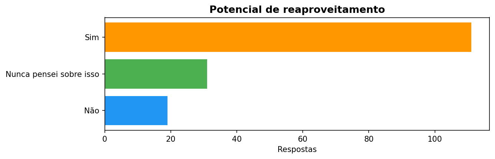

*Figura 3. Percepção dos respondentes sobre o potencial de reaproveitamento dos resíduos gerados. Aproximadamente 110 respondentes acreditavam que o resíduo pode ser reaproveitado.*

A variável `destino_atual` foi analisada a partir da versão padronizada da base, o que reduziu a fragmentação visual e tornou os resultados mais objetivos. A Figura 4 indica que a coleta pública comum predominou como destino dos resíduos.

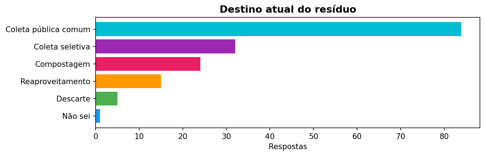

*Figura 4. Destino atual dos resíduos orgânicos após padronização das respostas livres em seis categorias. A coleta pública comum concentrou 84 das 161 respostas.*

### Clusterização

Foi utilizado o algoritmo K-Means com `k = 3`, em escolha exploratória, sobre seis variáveis: `tipo_gerador`, `quantidade_gerada`, `num_pessoas`, `destino_atual`, `interesse_aprender` e `tentativa_reutilizacao`. A análise identificou três perfis de geradores, cuja distribuição é apresentada na Figura 5.

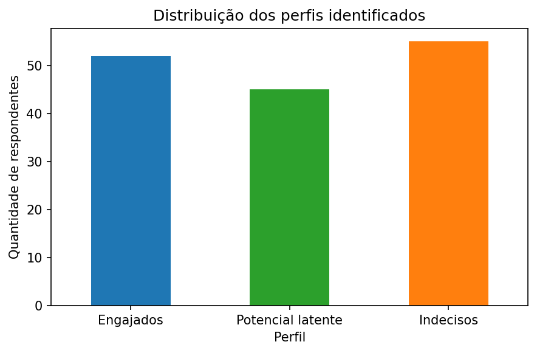

*Figura 5. Distribuição dos três perfis de geradores identificados por K-Means: Engajados (52), Potencial latente (45) e Indecisos (55).*

Para visualizar a separação entre os perfis, foi aplicada uma redução de dimensionalidade com PCA (duas componentes principais). A Figura 6 apresenta a projeção dos respondentes no espaço bidimensional, onde cada ponto representa um respondente e a cor indica o perfil atribuído.

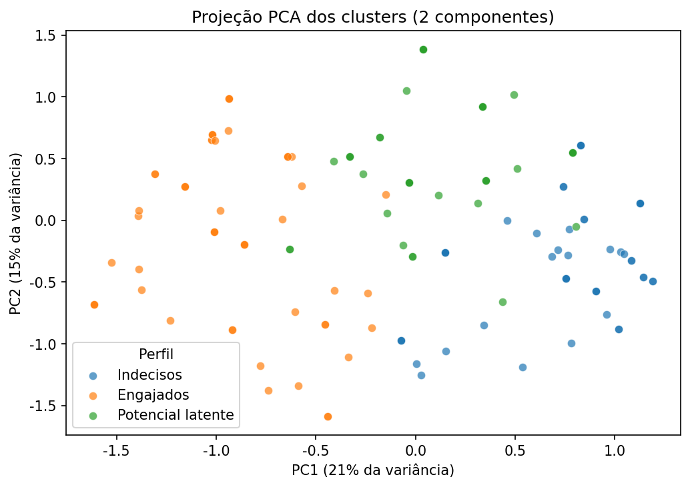

*Figura 6. Projeção PCA dos três clusters em duas dimensões. A sobreposição parcial entre os grupos é esperada, dado que as variáveis categóricas foram codificadas por one-hot encoding.*

### Classificação

Foram treinados dois modelos de Random Forest com 200 árvores, validação cruzada estratificada em 5 folds, `class_weight="balanced"` e threshold otimizado pelo índice de Youden. No primeiro modelo, o target de destino foi construído a partir das categorias padronizadas de `destino_atual`, binarizadas em destino passivo (coleta pública comum, descarte, aterro) e destino ativo (coleta seletiva, compostagem, reaproveitamento).

O primeiro modelo foi treinado para prever o destino do resíduo. A Figura 7 apresenta a curva ROC desse modelo, com AUC = 0.50, desempenho equivalente ao acaso. Esse resultado sugere que o destino do resíduo depende mais de fatores externos, como infraestrutura de coleta e acesso a alternativas, do que da percepção individual do respondente.

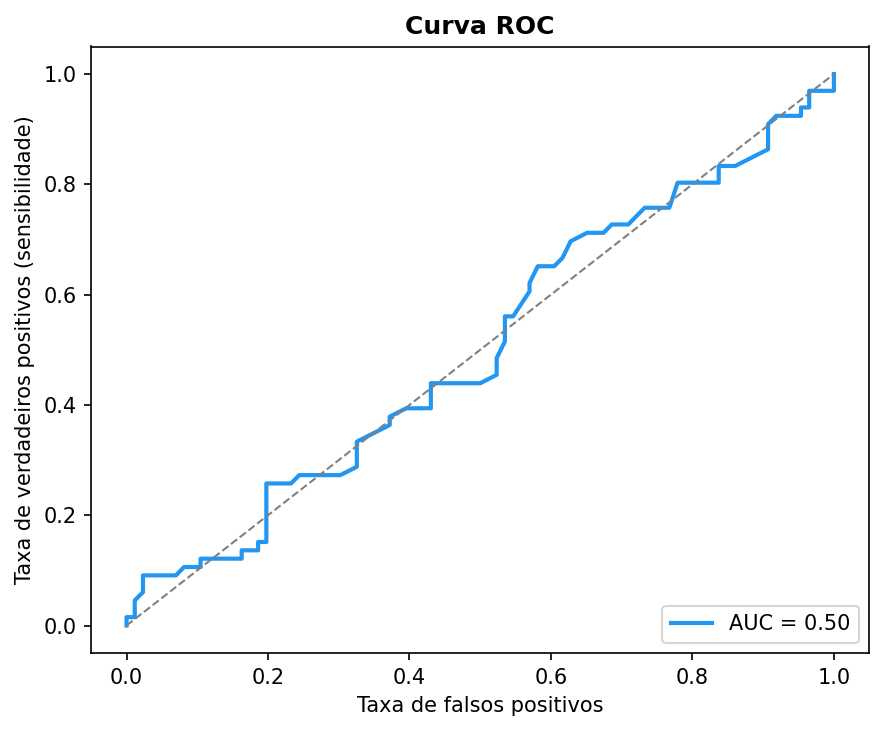

*Figura 7. Curva ROC do modelo de previsão de destino do resíduo. A AUC de 0.50 indica desempenho indistinguível do acaso, sugerindo que o destino depende de fatores externos ao questionário.*

O segundo modelo foi treinado para prever a tentativa de reutilização, e obteve resultado consideravelmente melhor. A Figura 8 apresenta a curva ROC com AUC = 0.76 e o ponto ótimo de threshold calculado pelo índice de Youden, cujo valor foi 0,47. O contraste entre os dois modelos é relevante: enquanto o destino escapou à previsão por fatores individuais, a tentativa de reutilização mostrou-se dependente de fatores internos, como percepção, interesse e disposição para agir.

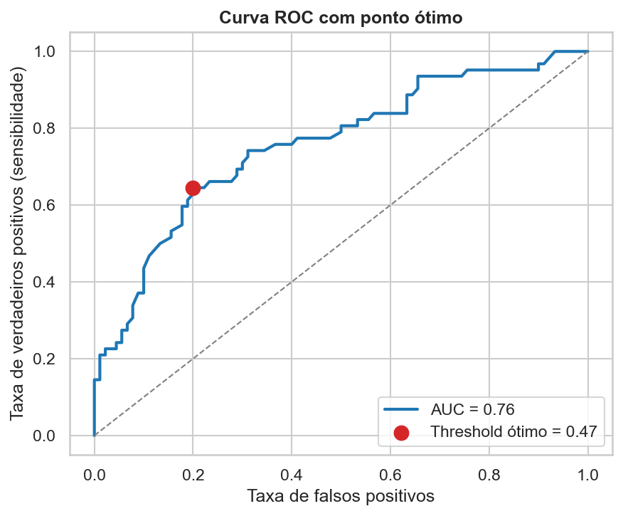

*Figura 8. Curva ROC do modelo de previsão de tentativa de reutilização. A AUC de 0.76 indica capacidade preditiva moderada, com o ponto ótimo de threshold marcado pelo índice de Youden.*

A Figura 9 apresenta as 15 variáveis mais importantes para o modelo de reutilização. O fator dominante foi `potencial_reaproveitamento`, a crença do respondente de que o resíduo pode ser reaproveitado. Essa variável se destacou com ampla margem sobre as demais.

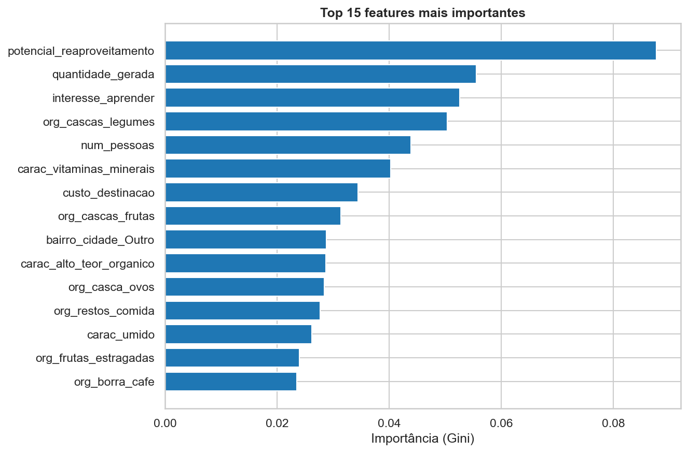

*Figura 9. As 15 variáveis mais importantes para prever a tentativa de reutilização, segundo o modelo Random Forest. A percepção de potencial de reaproveitamento liderou com ampla margem sobre as demais variáveis.*

A Figura 10 apresenta a matriz de confusão do modelo de reutilização com o threshold otimizado, que resultou em acurácia de 74%.

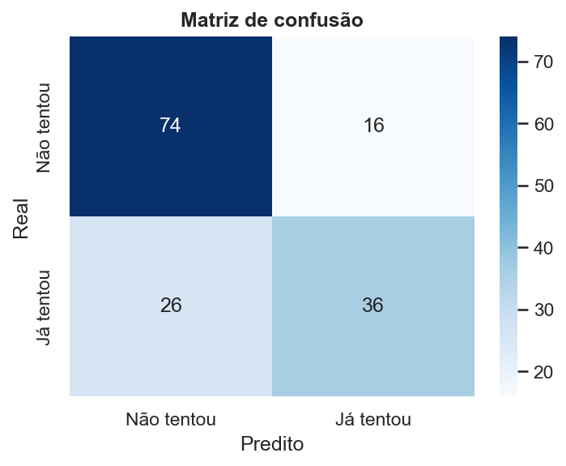

*Figura 10. Matriz de confusão do modelo de reutilização com threshold otimizado por Youden, resultando em acurácia de 74% sobre as 152 respostas utilizadas na modelagem.*

A Figura 11 detalha o perfil das 18 pessoas identificadas como oportunidade de intervenção. A combinação de crença no reaproveitamento com ausência de tentativa prática sugere que barreiras específicas, como falta de orientação ou de infraestrutura acessível, podem estar impedindo a ação nesse subgrupo.

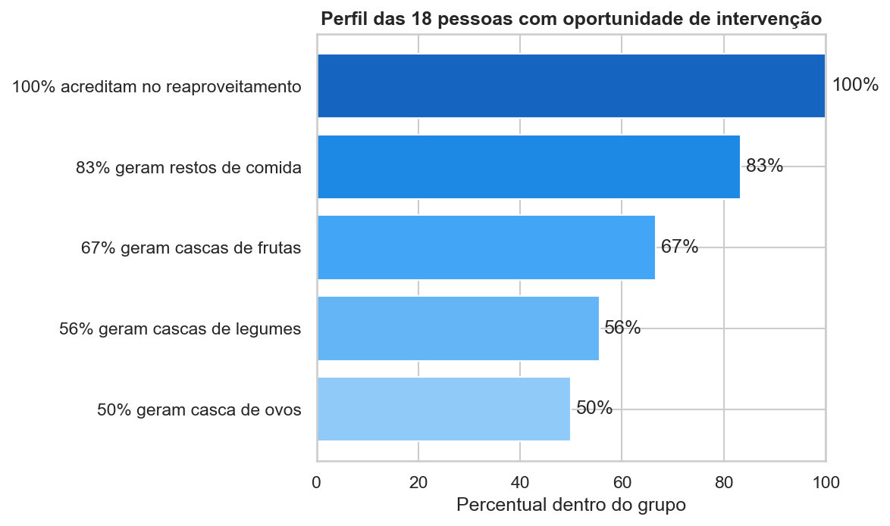

*Figura 11. Perfil das 18 pessoas com oportunidade de intervenção. Todas acreditam no reaproveitamento, 83% geram restos de comida, 67% geram cascas de frutas, 56% geram cascas de legumes e 50% geram casca de ovos.*

#### Quantificação da oportunidade em kg

As análises anteriores identificaram 18 pessoas como oportunidade de intervenção. A Figura 12 traduz essa oportunidade em termos concretos, quantificando o volume de resíduos orgânicos desperdiçados pelo grupo. Ao mapear as faixas de quantidade do questionário para pontos médios em kg/semana, estimou-se que esse grupo gera aproximadamente 6.786 kg de resíduos orgânicos por ano que poderiam ser reaproveitados.

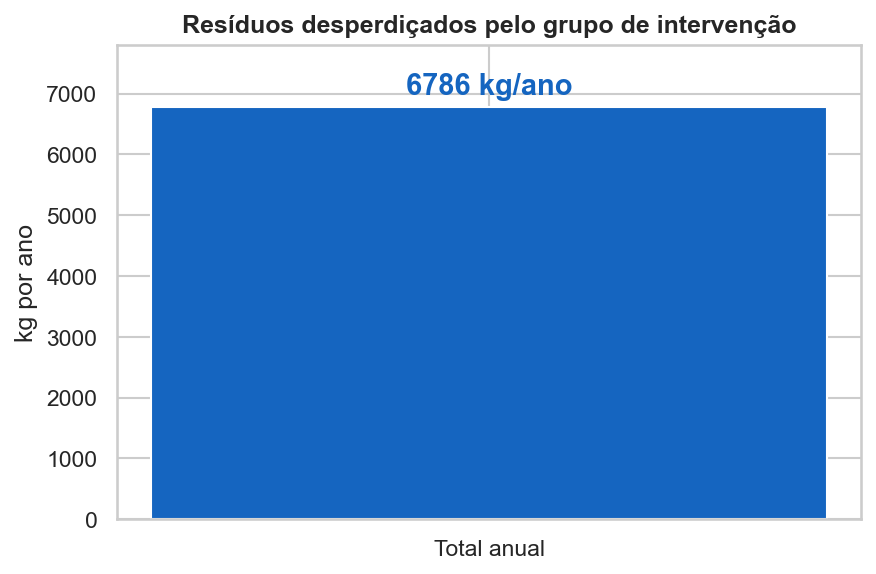

*Figura 12. Volume anual estimado de resíduos orgânicos gerados pelas 18 pessoas com oportunidade de intervenção. O total de 6.786 kg/ano foi calculado a partir dos pontos médios das faixas de quantidade declaradas no questionário.*

### Encoding das respostas

Para transformar respostas textuais em variáveis utilizáveis pelos algoritmos, foram adotadas três estratégias:

- encoding ordinal para variáveis com ordem natural, como `quantidade_gerada`, `num_pessoas`, `potencial_reaproveitamento`, `interesse_aprender` e `custo_destinacao`
- uso de `str.contains` em respostas de múltipla seleção, evitando fragmentação incorreta por vírgulas internas
- one-hot encoding para variáveis nominais, como tipo de gerador, tipo de atividade, bairro ou cidade e origem do resíduo

## Estrutura do repositório

A estrutura abaixo reflete os arquivos e pastas relevantes para a versão publicada do projeto.

```text
.
|-- dados/
|   |-- respostas_limpo.csv          # Base limpa gerada pelo notebook 00
|   `-- respostas_preliminares.csv   # Exportação bruta do Google Forms
|-- docs/
|   |-- 01_destino_atual.png
|   |-- 01_potencial_reaproveitamento.png
|   |-- 01_residuos_organicos.png
|   |-- 01_tipo_gerador.png
|   |-- 02_distribuicao_perfis.png
|   |-- 02_pca_clusters.png
|   |-- 03_roc_destino.png
|   |-- 04_feature_importance.png
|   |-- 04_kg_oportunidade.png
|   |-- 04_matriz_confusao.png
|   |-- 04_perfil_oportunidade.png
|   `-- 04_roc_reutilizacao.png
|-- LICENSE                          # Licença do projeto
|-- notebooks/
|   |-- 00_limpeza_dados.ipynb       # Limpeza da base e padronização inicial
|   |-- 01_analise_exploratoria.ipynb
|   |-- 02_clusterizacao.ipynb
|   |-- 03_classificacao.ipynb
|   `-- 04_classificacao_reutilizacao.ipynb
|-- README.md                        # Apresentação do projeto
|-- requirements.txt                 # Dependências Python
`-- scripts/
    `-- preprocessamento.py          # Script auxiliar de processamento
```

## Discussão

O contraste entre os dois modelos de classificação revela uma distinção importante sobre a natureza dos comportamentos investigados. O modelo de previsão de destino, com AUC = 0,50, não conseguiu superar o acaso, o que sugere que o destino dado ao resíduo é um comportamento mediado por infraestrutura: depende da existência de coleta seletiva no bairro, do acesso a pontos de compostagem e de outras condições externas ao indivíduo. Já o modelo de reutilização, com AUC = 0,76, indica que a tentativa de reutilizar é um comportamento mediado por consciência, associado a fatores como percepção, interesse e disposição pessoal para agir. Essa distinção tem implicações práticas diretas: políticas voltadas ao destino precisam atuar sobre infraestrutura, enquanto intervenções voltadas à reutilização podem atuar sobre educação e sensibilização.

A variável `potencial_reaproveitamento`, a crença do respondente de que o resíduo pode ser reaproveitado, emergiu como o fator mais preditivo do modelo de reutilização. Esse resultado sugere que a percepção de valor no resíduo precede e condiciona a tentativa de ação. As 18 pessoas identificadas como oportunidade de intervenção ilustram exatamente essa dinâmica: todas acreditam que o resíduo pode ser reaproveitado, mas nenhuma tentou fazê-lo. Esse subgrupo representa a ponte entre consciência e ação que ainda não foi cruzada, possivelmente por falta de orientação técnica, de acesso a métodos viáveis ou de estímulo institucional.

A articulação com a Engenharia Química torna-se especialmente relevante nesse ponto. O trabalho do parceiro interdisciplinar, ao desenvolver e demonstrar formas concretas de reaproveitamento de resíduos orgânicos, atua exatamente sobre o fator que o modelo identificou como mais preditivo. Se a crença no potencial de reaproveitamento é o que mais distingue quem tenta reutilizar de quem não tenta, então oferecer evidências práticas e acessíveis de que o reaproveitamento funciona pode ser o mecanismo mais eficaz para converter consciência em ação. Os resultados quantitativos do presente projeto fornecem, assim, uma base empírica para orientar as intervenções planejadas pela equipe de Engenharia Química.

## Limitações

- A base atual é preliminar, com 161 respostas, e os resultados podem mudar com a ampliação da amostra.
- A escolha de `k = 3` na clusterização foi exploratória, não validada por métricas formais como silhouette score. Ela produziu grupos interpretáveis, mas não deve ser tratada como número definitivo de perfis.
- O modelo de destino do resíduo teve desempenho próximo ao aleatório. Ele é útil como resultado analítico, mas não como ferramenta de decisão individual.
- As importâncias das variáveis e o threshold ótimo do modelo de reutilização devem ser reavaliados quando a coleta estiver mais madura.

## Próximos passos

- **Ampliação da amostra.** A coleta de dados ainda está em andamento. Com mais respostas, espera-se maior robustez nos modelos e nos perfis identificados pela clusterização.
- **Análise por tipo de resíduo.** Construir fichas preditivas individuais por categoria de resíduo orgânico (restos de comida, cascas de frutas, cascas de legumes, entre outros), permitindo intervenções direcionadas ao material específico.
- **Incorporação de SHAP values.** Utilizar SHAP (SHapley Additive exPlanations) para fornecer explicabilidade por subgrupo, detalhando como cada variável contribui para a predição em diferentes perfis de geradores.

## Como reproduzir

```bash
git clone <repo-url>
cd residuos-chapeco-ml
python -m venv .venv
source .venv/bin/activate
pip install -r requirements.txt
jupyter notebook
```

No Windows PowerShell:

```powershell
.\.venv\Scripts\Activate.ps1
```

Execute os notebooks nesta ordem:

1. `00_limpeza_dados.ipynb`
2. `01_analise_exploratoria.ipynb`
3. `02_clusterizacao.ipynb`
4. `03_classificacao.ipynb`
5. `04_classificacao_reutilizacao.ipynb`

## Licença

Este projeto está licenciado sob a [MIT License](LICENSE).
