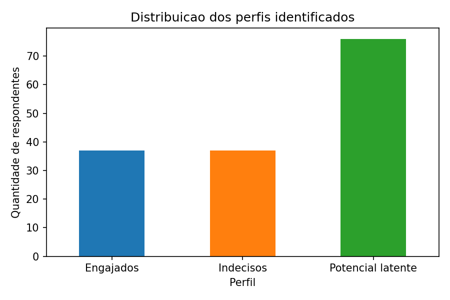
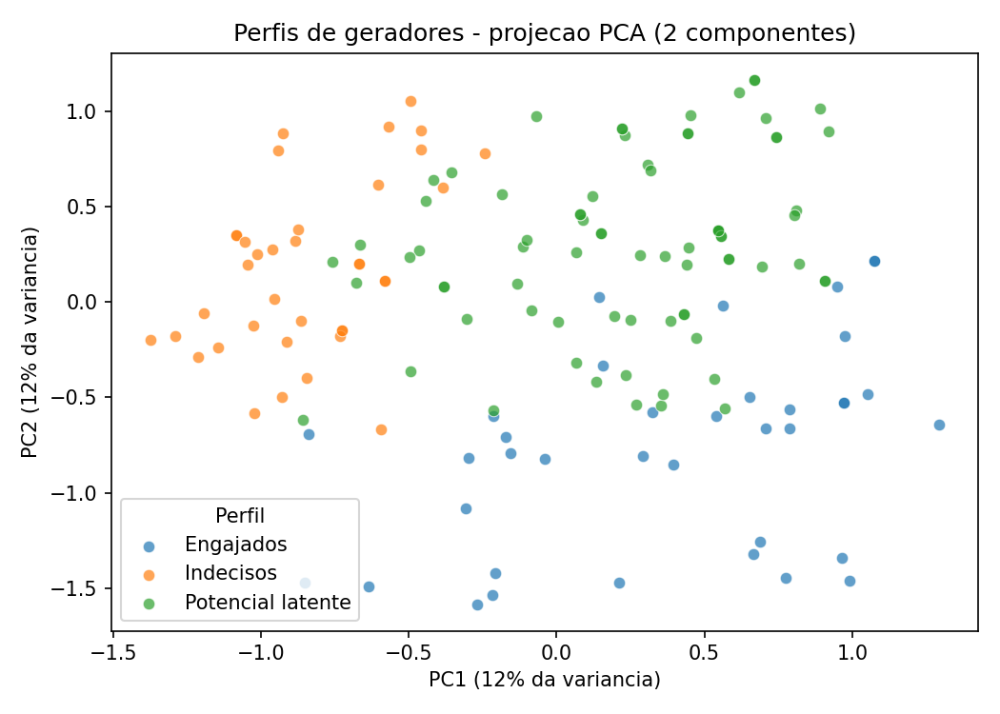
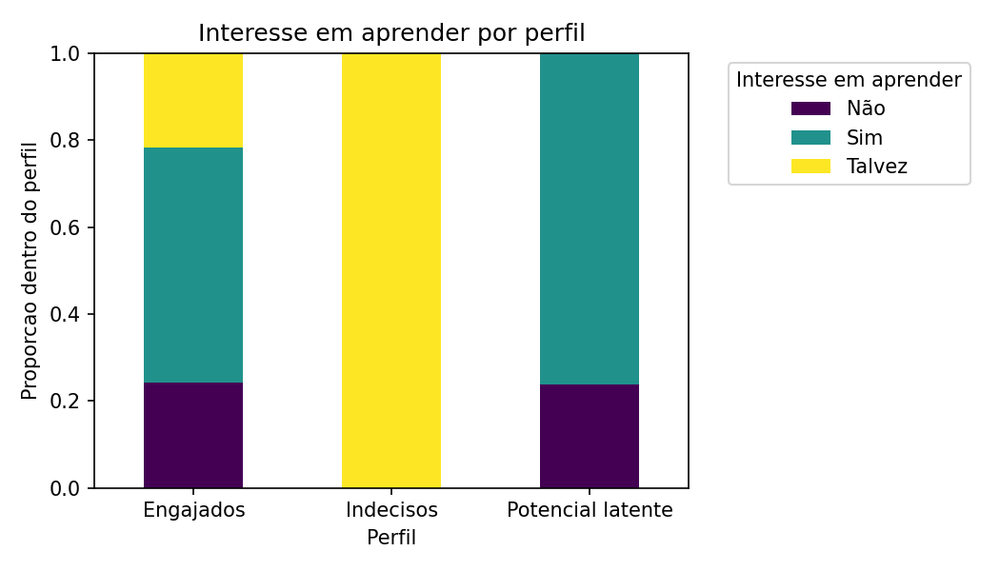

# Residuos Chapeco ML

Simulacao, analise exploratoria e clusterizacao de dados sobre geracao e destinacao de residuos solidos em Chapeco-SC.

---

## Objetivo do projeto

- Simular respostas de um formulario sobre geracao e destinacao de residuos solidos em Chapeco.
- Explorar a distribuicao das variaveis e entender o perfil dos geradores.
- Identificar perfis de geradores por meio de tecnicas de clustering (K-Means).

---

## Estrutura do repositorio

```text
residuos-chapeco-ml/
├── dados/
│   ├── publicos/                          # (reservado para bases publicas futuras)
│   └── simulados/
│       └── respostas_simuladas.csv        # 150 respostas simuladas, 14 variaveis
├── notebooks/
│   ├── 00_geracao_dados_simulados.ipynb   # Gera o CSV com semente fixa + dicionario de dados
│   ├── 01_analise_exploratoria.ipynb      # Graficos de distribuicao por variavel
│   └── 02_clusterizacao.ipynb             # K-Means (3 perfis) + PCA + analise de perfis
├── scripts/
│   └── preprocessamento.py               # (reservado para tratamento e validacao)
├── docs/                                  # Imagens geradas pelos notebooks
├── requirements.txt
├── LICENSE                                # MIT
└── README.md
```

---

## Como reproduzir

**Python 3.10+**

1. Clone o repositorio e crie um ambiente virtual:

```bash
git clone <url-do-repositorio>
cd residuos-chapeco-ml

python -m venv .venv

# Linux / macOS
source .venv/bin/activate

# Windows (PowerShell)
.\.venv\Scripts\Activate.ps1
```

2. Instale as dependencias:

```bash
pip install -r requirements.txt
```

3. Execute os notebooks em ordem:

```
00_geracao_dados_simulados.ipynb  →  gera o CSV e apresenta o dicionario de dados
01_analise_exploratoria.ipynb     →  graficos de distribuicao por variavel
02_clusterizacao.ipynb            →  clusterizacao, rotulacao de perfis e PCA
```

> Selecione o kernel do `.venv` ao abrir os notebooks para evitar erros de importacao.

---

## Previa dos resultados

### Distribuicao dos perfis identificados



### Projecao PCA dos clusters



### Interesse em aprender por perfil



**Observacoes:**

- Os dados sao **simulados** com distribuicoes baseadas em literatura academica e servem como prototipo ate a coleta real.
- O K-Means identificou **3 perfis** entre os 150 respondentes:
  - **Engajados** (cluster 0) — ja tentaram reutilizar seus residuos e querem aprender mais.
  - **Indecisos** (cluster 1) — nao tentaram reutilizar e estao em duvida se querem aprender.
  - **Potencial latente** (cluster 2, 76 respondentes) — demonstram interesse em aprender (~76% responderam "Sim"), mas **nunca tentaram** reutilizar (100% responderam "Nao"). Perfil prioritario para acoes de educacao ambiental.

---

## Proximos passos

- Substituir os dados simulados pelos dados reais coletados via formulario na comunidade.
- Incluir metricas de qualidade dos clusters (silhouette score, metodo do cotovelo).
- Explorar modelos de classificacao supervisionada na Fase 2 do projeto.

---

## Contexto do projeto integrado

Este projeto faz parte de uma parceria entre os cursos de **Engenharia Quimica** e **Ciencia da Computacao**, com foco em apoiar a gestao de residuos solidos no municipio de Chapeco-SC. A proposta combina dados coletados diretamente na comunidade com bases publicas (IBGE, SNIS, ABRELPE) para construir ferramentas de analise e apoio a decisao baseadas em aprendizado de maquina.

---

## Referencias

As distribuicoes de probabilidade utilizadas na simulacao foram baseadas nas seguintes fontes:

1. **ABRELPE** — Panorama dos Residuos Solidos no Brasil, 2023. Disponivel em: <https://www.abrema.org.br/wp-content/uploads/dlm_uploads/2024/03/Panorama_2023_P1.pdf>
2. **IBGE** — Censo Demografico 2022, resultados preliminares. Disponivel em: <https://agenciadenoticias.ibge.gov.br>
3. **IBGE** — MUNIC 2023, Pesquisa de Informacoes Basicas Municipais. Disponivel em: <https://agenciadenoticias.ibge.gov.br/agencia-noticias/2012-agencia-de-noticias/noticias/41994>
4. **SNIS** — Serie Historica do Sistema Nacional de Informacoes sobre Saneamento, dados por municipio. Disponivel em: <https://dados.gov.br/dados/conjuntos-dados/snis---srie-histrica>
5. Renda e evolucao da geracao per capita de residuos solidos no Brasil — **SciELO**, 2012. Disponivel em: <https://www.scielo.br/j/esa/a/kZn74jmyqBL5GNT4yxkD8Jk/>
6. Gestao de residuos domiciliares — **SciELO**, 2023. Disponivel em: <https://www.scielo.br/j/urbe/a/5YQCmrGs9Mh3s3LDpsQY8jD/>
7. Composicao gravimetrica e estimativa de geracao per capita — RS, 2020. Disponivel em: <http://revista.ecogestaobrasil.net/v7n16/v07n16a31.pdf>
8. Estudo do perfil de residuos solidos domesticos — **REMA**, 2021. Disponivel em: <https://editoraime.com.br/revistas/index.php/rema/article/view/2730>
9. Brasil e um dos principais geradores de residuo plastico no mundo — **Interacoes**, UCDB. Disponivel em: <https://interacoes.ucdb.br/interacoes/article/download/3671/2784>
10. Development of waste-to-energy through integrated sustainable waste management — **PMC**, 2023. Disponivel em: <https://pmc.ncbi.nlm.nih.gov/articles/PMC9838418/>
11. Evaluation of a municipal program of selective collection — **UEM**, 2013. Disponivel em: <https://periodicos.uem.br/ojs/index.php/ActaSciTechnol/article/download/16095/pdf>
12. Economic analysis of solid waste gravimetric composition — 2022. Disponivel em: <https://studiespublicacoes.com.br/ojs/index.php/seas/article/view/442>
13. Pilot Study of Generation and Disposal of Municipal Solid Wastes — **Sciendo**, 2014. Disponivel em: <https://www.sciendo.com/article/10.2478/pjct-2014-0030>
14. Social innovation in waste management in residential buildings — **PUC-SP**, 2023. Disponivel em: <https://revistas.pucsp.br/index.php/risus/article/download/61988/43173>

---

## Licenca

Este projeto esta licenciado sob a [MIT License](LICENSE).
